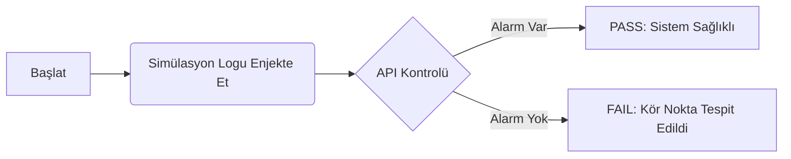

# 🛡️ SecOps-Research-Framework (SRF)

> **Otonom Savunma, Sürekli Doğrulama ve "Detection as Code" Mimarisi**


## 📖 Proje Hakkında
**SecOps-Research-Framework (SRF)**, geleneksel siber güvenlik operasyonlarını (SOC) pasif bir izleme süreci olmaktan çıkarıp, kendi kendini test eden ve doğrulayan **otonom bir mühendislik disiplinine** dönüştürmeyi hedefler.

Yazılım dünyasındaki **CI/CD (Sürekli Entegrasyon/Dağıtım)** prensiplerini siber güvenliğe uyarlayan bu proje, sistemin tespit yeteneklerini sürekli olarak **"Watchdog" (Gözcü)** mekanizmasıyla denetler ve "Sessiz Hataları" (Silent Failures) ortadan kaldırır.

---

## 🚀 Temel Özellikler

### 1. Otonom Test (Auto-Test Ability)
Sistem, saldırganı beklemez. Periyodik olarak kendine zararsız, simüle edilmiş saldırı logları gönderir ve bunları tespit edip edemediğini kontrol eder.
* **Trigger:** Sahte saldırı simülasyonu.
* **Verify:** API üzerinden tespit doğrulaması.
* **Report:** Anlık [PASS] veya [FAIL] durumu.

### 2. Yönetim Konsolu (SRF-CLI)
Tüm framework, kullanıcı dostu bir **Komut Satırı Arayüzü (CLI)** üzerinden yönetilir.
* Sistem sağlık kontrolü.
* Tek tuşla otonom test başlatma.
* Denetim (Audit) loglarını görüntüleme.

### 3. Detection as Code
Güvenlik kuralları statik ayarlar değil, versiyonlanabilir yazılım kodları olarak yönetilir (`src/rules/local_rules.xml`).

---

## 🛠️ Mimari ve Bileşenler

Proje, endüstriyel standartlara uygun modüler bir dizin yapısına sahiptir:

```text
SecOps-Research-Framework/
├── project.json            # Proje Kimliği ve Metadata
├── src/
│   ├── srf-cli.sh          # Yönetim Aracı (Orkestrasyon)
│   ├── automation/         # Otonom Test Motoru (Watchdog)
│   └── rules/              # Tespit Kuralları (Logic Layer)
├── docs/                   # Mimari Şemalar ve Kullanım Kılavuzu
└── specs/                  # Sistem Gereksinimleri ve Analiz

```

---

## ⚙️ Kurulum ve Kullanım

### 1. Ön Gereksinimler

Bu framework **Ubuntu 22.04 LTS** üzerinde test edilmiştir. Aşağıdaki paketlerin yüklü olması gerekir:

```bash
sudo apt update && sudo apt install curl jq wazuh-agent

```

### 2. Kurulum

Repoyu klonlayın ve çalıştırma izinlerini verin:

```bash
git clone [https://github.com/kullaniciadi/SecOps-Research-Framework.git](https://github.com/kullaniciadi/SecOps-Research-Framework.git)
cd SecOps-Research-Framework
chmod +x src/srf-cli.sh src/automation/secops-watchdog.sh

```

### 3. Çalıştırma

Ana yönetim aracını başlatın:

```bash
./src/srf-cli.sh

```

Açılan menüden **[2] Execute Auto-Test** seçeneğini seçerek sistemin otonom test yeteneğini gözlemleyebilirsiniz.

---

## 📊 Çalışma Mantığı (Döngü)



1. **Enjeksiyon:** `secops-watchdog` sisteme özel bir log yazar.
2. **Bekleme:** Logun işlenmesi için 5 saniye beklenir.
3. **Sorgu:** API'ye "Bu logu gördün mü?" diye sorulur.
4. **Karar:** Sonuç ekrana ve log dosyasına yazılır.

---

## 👨‍💻 Geliştirici

**Safa Hacıbayramoğlu**
*DevSecOps & Security Researcher*

```

```
